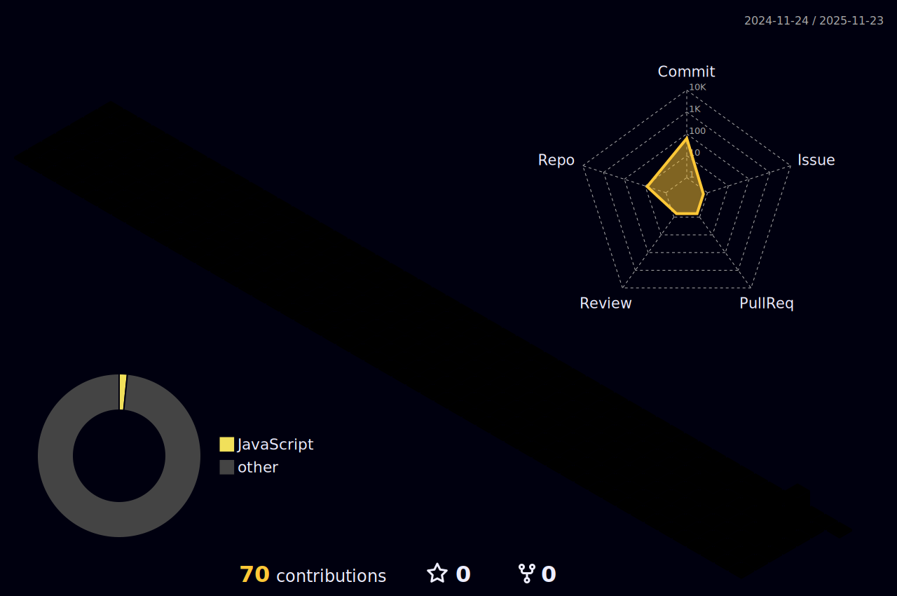

<div align="center">

<!-- 🐱 GIF del gato -->


<h1 align="center">
  
</h1>


<div align="center">
  
  <br><br>
  
  <a href="https://www.youtube.com/watch?v=jNCMvCGivgk&list=RDjNCMvCGivgk&start_radio=1">
    
  </a>
  
  <p><b>🎧 Listen with me 🎧👆</b></p>
</div>


<!-- Badges épicos animados -->
<p>
  
  
  
  
</p>

</div>


## 🎯 About Me


```python
class Smith:
    def __init__(self):
        self.name = "Smith Flores Limas"
        self.role = "Software Engineer & AI Enthusiast"
        self.location = "Huánuco, Perú 🇵🇪"
        self.education = "Software Engineering @ SENATI"
        self.languages = ["Python", "JavaScript", "HTML/CSS"]
        self.current_focus = "Machine Learning & AI"
        self.interests = [
            "🤖 Artificial Intelligence",
            "📊 Data Science & Analytics", 
            "🌐 Web Development",
            "🎨 UI/UX Design",
            "☁️ Cloud Computing"
        ]
        
    def current_projects(self):
        return {
            "learning": ["Deep Learning", "Computer Vision"],
            "building": ["AI-powered Apps", "Data Dashboards"],
            "exploring": ["Neural Networks", "NLP"]
        }
    
    def say_hi(self):
        print("Thanks for dropping by! Let's build something amazing together 🚀")

me = Smith()
me.say_hi()
```

<br clear="right"/>

---

## 🛠️ Tech Arsenal

<div align="center">

### 💻 Programming Languages
<p>
  
</p>

### 🤖 AI/ML & Data Science
<p>
  
  
  
  
</p>

### 🎨 Frontend Development
<p>
  
</p>

### ⚙️ Backend & Databases
<p>
  
</p>

### 🔧 Tools & Platforms
<p>
  
</p>

</div>


---

## 🚀 Featured Projects

<div align="center">

<table>
<tr>
<td width="50%" valign="top">

### 🎨 Color Clustering System


**Advanced image analysis using K-Means clustering and PCA**

🔹 Extract dominant color palettes  
🔹 Interactive visualizations with Plotly  
🔹 Real-time processing with Streamlit  
🔹 PCA dimensionality reduction  

**Tech Stack:** `Python` `scikit-learn` `Streamlit` `Plotly` `NumPy`

[](https://github.com/Smith-Sr)

</td>
<td width="50%" valign="top">

### 👥 Customer Segmentation AI


**AI-powered customer analysis platform**

🔹 Machine learning segmentation  
🔹 Interactive dashboards with Gradio  
🔹 Real-time predictions  
🔹 Business intelligence insights  

**Tech Stack:** `Python` `Gradio` `Pandas` `Matplotlib` `K-Means`

[](https://github.com/Smith-Sr)

</td>
</tr>

<tr>
<td width="50%" valign="top">

### 🧠 More Projects Coming Soon...


🔹 Deep Learning Image Classifier  
🔹 Natural Language Processing App  
🔹 Real-time Data Dashboard  

Stay tuned! 🚀

</td>
<td width="50%" valign="top">

### 💡 Open Source Contributions


🔹 Active in ML/AI communities  
🔹 Code reviews & bug fixes  
🔹 Documentation improvements  

Check my contributions! 👇

</td>
</tr>
</table>

</div>


---

## 📊 GitHub Statistics

<div align="center">


</div>

<div align="center">
  
</div>

<div align="center">
  
</div>


---

## ⏰ Coding Activity & Productivity

<div align="center">

### 🦉 I'm a Night Owl Developer

```text
🌞 Morning    ████░░░░░░░░░░░░░░░░   15.53%
🌆 Daytime    ████████░░░░░░░░░░░░   29.75%
🌃 Evening    ███████░░░░░░░░░░░░░   24.87%
🌙 Night      ████████░░░░░░░░░░░░   29.86%
```

### 📅 Most Productive on Friday

```text
Monday      ████░░░░░░░░░░░░░░░░   13.51%
Tuesday     ████░░░░░░░░░░░░░░░░   13.75%
Wednesday   █████░░░░░░░░░░░░░░░   17.44%
Thursday    ███░░░░░░░░░░░░░░░░░   11.24%
Friday      █████░░░░░░░░░░░░░░░   17.53% 🔥
Saturday    ███░░░░░░░░░░░░░░░░░   11.95%
Sunday      ████░░░░░░░░░░░░░░░░   14.58%
```


</div>


---

## 🎨 3D Contribution Visualization

<div align="center">

  <a href="https://raw.githubusercontent.com/Smith-Sr/Smith-Sr/main/profile-3d-contrib/profile-night-rainbow.svg" target="_blank">
    
  </a>

</div>


---

## 🏆 GitHub Achievements

<div align="center">


</div>


---

## 🐍 Contribution Snake eating my contributions

<div align="center">


</div>


---

## 💼 Experience & Education

<div align="center">

### 🎓 Education
**Técnico en Ingeniería de Software**  
Instituto de Educación Superior Tecnológica SENATI  
📅 Feb. 2022 - Present | 📍 Huánuco, Perú

### 💼 Work Experience

<table>
<tr>
<td align="center" width="50%">

**🔧 Mantenimiento**  
++++++++++++++++++++++++++++++++++++++++++
📅 Santa Lucía, Perú  
*General maintenance operations*

</td>
<td align="center" width="50%">

**👨‍💼 Administrador**  
+++++++++++++++++++++++++++++++++++++++++
📅 Santa Lucía, Perú  
*Staff management & operations*

</td>
</tr>
</table>

</div>


---

## 📫 Let's Connect!

<div align="center">

### 🌐 Find me around the web

<p>
  <a href="mailto:sirsmith.limas@gmail.com">
    
  </a>
  <a href="https://www.linkedin.com/in/limas-smith/">
    
  </a>
  <a href="https://github.com/Smith-Sr">
    
  </a>
  <a href="https://twitter.com/smith">
    
  </a>
</p>

### 📞 Contact Information

📧 **Email:** sirsmith.limas@gmail.com  
📱 **Phone:** +51 946747700 |  
📍 **Location:** Amarilis, Huánuco, Perú

</div>


---

## 💭 Random Dev Quote

<div align="center">


</div>


---

## ⚡ Fun Facts About Me

<div align="center">

```javascript
const smith = {
    code: ["Python", "JavaScript", "HTML/CSS"],
    askMeAbout: ["AI/ML", "web dev", "data science", "automation"],
    technologies: {
        frontEnd: ["React", "Vue", "Tailwind CSS"],
        backEnd: ["Flask", "FastAPI", "Node.js"],
        databases: ["MySQL", "MongoDB", "PostgreSQL"],
        devOps: ["Docker", "Git", "Linux"],
        machineLearning: ["scikit-learn", "TensorFlow", "Pandas"]
    },
    currentFocus: "Building AI-powered applications that solve real problems",
    funFact: "I turn coffee ☕ into code 💻 and bugs 🐛 into features ✨"
};
```

### 🎯 2025 Goals
- 🤖 Master Deep Learning & Neural Networks
- 🌟 Contribute to 10+ Open Source Projects
- 📱 Build 5 Production-Ready AI Apps
- 📚 Learn Cloud Computing (AWS/Azure)
- 🎓 Complete Advanced ML Certifications

</div>


---

<div align="center">

### 💖 Thanks for visiting!


**Always open to new professional connections. Feel free to say hello if you'd like to exchange ideas.** 😊

---


<p>
  
</p>

**Made with 💙 and ☕ by Smith Limas**

</div>
